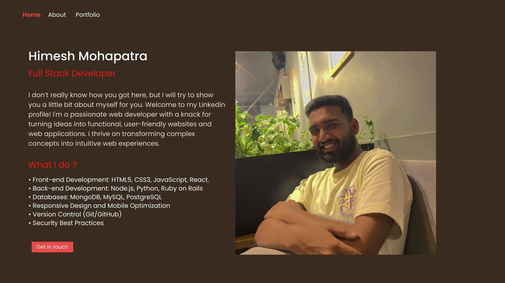

<!--
**himeshx/himeshx** is a ✨ _special_ ✨ repository because its `README.md` (this file) appears on your GitHub profile.

Here are some ideas to get you started:

- 🔭 I’m currently working on ...
- 🌱 I’m currently learning ...
- 👯 I’m looking to collaborate on ...
- 🤔 I’m looking for help with ...
- 💬 Ask me about ...
- 📫 How to reach me: ...
- 😄 Pronouns: ...
- ⚡ Fun fact: ...
-->
<!--banner -->

## 🌐 Socials:
   
 

## Hello there 👋

I don't really know how you got here, but I will try to show a little bit about myself for you.

## Public information
My name is Himesh Mohapatra. I currently live in Bhubaneswar, India. I am an Under Grad KIIT'25 and currently working at RnPSoft as a FullStack Developer.
I'm a passionate web developer with a knack for turning ideas into functional, user-friendly websites and web applications. I am looking to contribute in Open Source Projects.

## Skills

 

   
	<a href="https://www.linux.org/" target="_blank" rel="noreferrer"> 
<a href="https://www.python.org" target="_blank" rel="noreferrer"> 
   -->
	

## Detailed information

* 👨🏽‍💻 **Name**: Himesh Mohapatra
* 🌱 **Age**: 21
* 📫 **Living in**: Bhubaneswar - Odisha, India
* 💬 **Stack**: C - C++ - HTML - CSS - Javasript - React - Angular - Vue.js - Node.js - Python - Ruby - MongoDB - MySQL - Express.js - jQuery - Firebase.com - HTML DOM - ES5 - JSON - XML - Apache - Linux
* 💻 **University**: Kalinga Institute of Industrial Technology

<!-- My Social Handles -->

<b>Connect with me:</b>

&emsp;
&emsp;
&emsp;

## Curiosities about me

* Currently working as a Full Stack developer at RnPSoft; 
* Active member of coding clubs with prior experience in C language,C++,HTML,Javascript,CSS; 
* I started with coding using **C lang**;
* I am looking to contribute in Open Source Projects;

## Watch my contributions get eaten by snake 🐍

<!-- Contribution Snake -->

<!-- Footer -->

